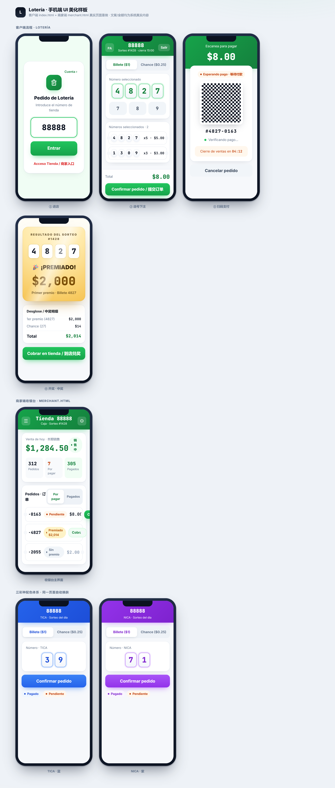

# casagrade · 彩票无纸化下单 · 收款 · 结算系统

> **店里不打单，门口不排队。** 客人在家下单 · 老板手机确认收款 · 店里零痕迹。
> 面向巴拿马彩票（**Lotería Nacional / TICA / NICA**）的全数字化 POS 系统。

🌐 在线介绍 / 使用指南：**https://www.casagrade.com/guide.html**
📱 客户端 & 老板端 APP（Android）：见官网下载

---

## 这是什么

一套让彩票店主告别"手写单、排长队、留票根"的全数字化经营系统：

```
客人扫海报二维码 → 自助选号下单 → 老板端实时收到订单 → 确认收款
                                              ↓
                       开奖后全自动核单结算（销售额 / 赔付 / 净利润一眼清）
```

- **客户端**：扫码自助下单、线上转账或到店现金、订单状态轮询、扫码兑奖
- **老板端（收银台）**：九宫格快捷代客下单、扫码 / 搜后四位找单、确认收款、兑奖、蓝牙小票自动打印、跳转结算
- **管理 / 大庄**：多设备实时同步、子店绑定与佣金自动结算

## 主要功能

| 模块 | 能力 |
|------|------|
| 下单 | 客人自助下单 · 老板代客下单（九宫格连续输入）· 一键重新下单 |
| 收款 | 线上转账（QR + WhatsApp 分享）· 现金到店 · 5 秒确认 |
| 彩种 | Lotería Nacional · TICA · NICA，独立销售与结算 |
| 兑奖 | 扫码 / 跨期搜后四位定位订单 · 一键兑奖 |
| 打印 | 蓝牙热敏小票（含可扫码兑奖二维码）· 自动重连 · 失败重打 |
| 经营 | 热门号码 TOP12 · 每号销售限额 · 自定义赔率（三彩种独立）|
| 结算 | 开奖全自动核单 · 销售/赔付/净利润 · 近 20 期历史 |
| 协同 | 同账号多设备实时同步 · 大庄多店管理 + 佣金自动结算 |
| 体验 | 中 / 西双语 · 移动端 WebView APP（原生扫码 + 蓝牙打印）|

## 界面预览



> 更多界面与完整使用流程见在线指南：https://www.casagrade.com/guide.html

## 技术栈

- **前端**：纯 HTML / CSS / JS（无构建步骤）+ 预编译 Tailwind 样式
- **静态服务**：Node.js / Express（`server.js`，开发期 `/api` 代理到后端）
- **后端**：NestJS + TypeORM + SQLite（**不在本仓库公开**）
- **移动端**：Android WebView 封装，原生蓝牙打印 / 相机扫码 / 生命周期插件

## 关于本仓库

本仓库仅作 **产品 / 前端展示**用途，包含面向用户的前端页面与样式。
**后端服务、数据库、密钥与凭证均不在此公开。**

## 联系 / 软件定制

做软件设计开发，可通过官网或 WhatsApp 联系：**https://wa.me/68040864**

---

© casagrade · 保留所有权利（All rights reserved）。代码仅供展示，未经授权请勿用于商业用途。
